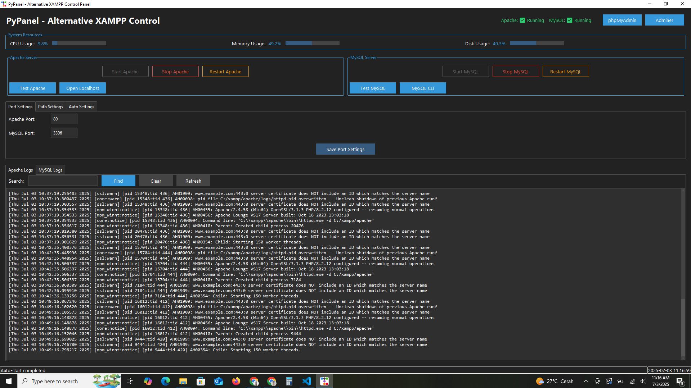

# PyPanel

**PyPanel** is a modern, lightweight, and user-friendly local server management application built with Python and Tkinter. Designed as a powerful alternative to XAMPP, PyPanel provides developers and enthusiasts with an intuitive GUI to easily start, stop, and monitor Apache and MySQL services on Windows.

---

## Key Features

- **Start/Stop Services:** Control Apache and MySQL servers with a simple click.
- **Real-Time Status:** Visual indicators to display whether services are running or stopped.
- **Log Viewer:** Integrated viewer for Apache and MySQL logs, updated live.
- **Port Configuration:** Easily customize Apache and MySQL ports without manual file edits.
- **Custom htdocs Folder:** Select your web root folder dynamically.
- **Auto-Start Services:** Option to launch services automatically when PyPanel starts.
- **Standalone Executable:** Packaged as a single `.exe` file for hassle-free distribution.

---


### Main Dashboard




---

## Installation

### Prerequisites

- Windows OS  
- Python 3.7 or higher installed  
- Apache & MySQL installed (e.g., via XAMPP)  
- [ttkbootstrap](https://github.com/israel-dryer/ttkbootstrap) Python package

### Steps

1. Clone the repository:

    ```bash
    git clone https://github.com/Bahrul-Rozak/PyPanel.git
    cd PyPanel
    ```

2. Install dependencies:

    ```bash
    pip install -r requirements.txt
    ```

3. Run the application:

    ```bash
    python main.py
    ```

---

## Usage Guide

- Use **Start/Stop** buttons to control Apache and MySQL services.  
- Monitor service status in real-time on the dashboard.  
- Open **Log Viewer** tabs to read latest logs without leaving the app.  
- Modify Apache/MySQL ports easily via **Port Configuration**.  
- Select your preferred `htdocs` folder under settings.  
- Enable or disable **Auto-Start** for services when the app launches.

---

## Build Executable

To generate a Windows executable (.exe), use PyInstaller:

```bash
pyinstaller --windowed main.py

